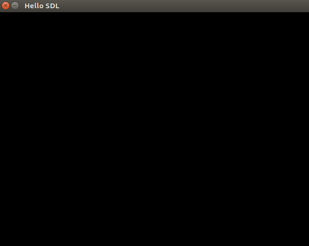

# Creating-The-First-SDL-Window
```
A simple graphics window creation using Simple DirectMedia Layer library. 
```
1. open terminal
2. apt-get update
3. apt-get install libsdl2-dev
4. cd to the path where the .cpp file is.
5. g++ mySDL.cpp -w -lSDL2 -o mySDL
6. ./mySDL


